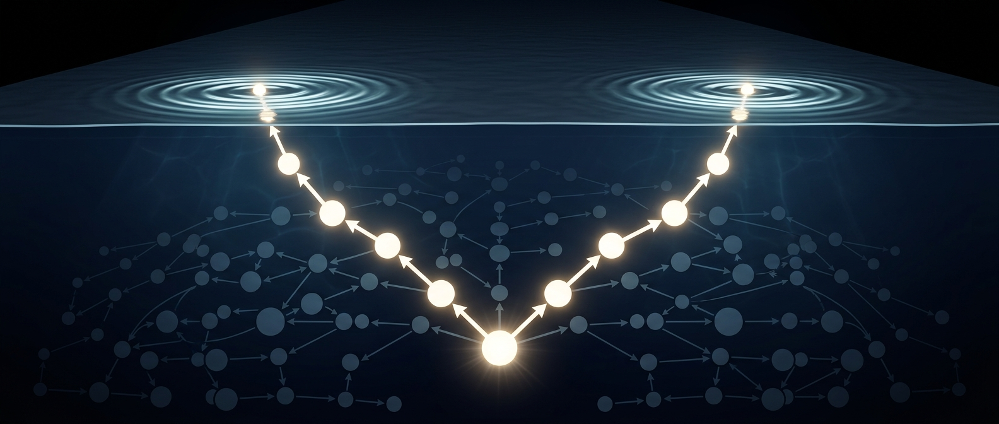

# Spooky Action on the Ledger

*Quest for Entropy #16: two particles, far apart, agree on an answer neither was carrying. On the ledger it is neither spooky nor action.*



## The question

> The Paper: [paper/the-iceberg-model.md](https://github.com/questforentropy/iceberg-model/blob/main/paper/the-iceberg-model.md)

Last episode ended with a promise: we go below the waterline.

Two episodes back I locked a cat in a box and got superposition out of a promise — the construct every developer awaits daily. That one was about how strange a system feels from the inside. Last episode, spacetime turned out not to be installed anywhere: no geometry, no force law, yet clocks slow and light bends — how much furniture a big system grows on its own.

This time they come together, and we go deeper — into the hidden layer, where the heart of the machine sits: the ledger.

The guide is the oldest scandal in physics. Two particles are born together and carried far apart. Alice measures hers, Bob measures his, and their answers line up far better than two separated things have any business managing. Einstein called it spooky action at a distance.

But first, the confession from the cat piece — it is the reason this episode exists.

A promise pends toward a boolean — one plain value. A quantum object is not a boolean. It is a wave: it has phase, it can interfere, two parts of it can cancel out. And there is a worse part, which bothered me for years. One particle's wave lives in three dimensions. Two particles do *not* get three each and go their separate ways. They get **one wave in six**. Three particles, nine. It grows with the number of participants and never stops — a wave function of the whole universe, three dimensions times however many particles exist. Nobody can picture that. I certainly couldn't.

Then one day I caught myself asking a question from my day job. Suppose you had to write down the state of Facebook. Not the pictures — the *state*. Every friendship, every draft, every half-delivered message. Or of git, across every clone on earth. How many dimensions is that? How many transactions settled, how many in flight? Ask an architect for "the state of the system, right now" and watch them go quiet.

That does not make the wave function ordinary. But it moved it, for me, from *impossible object* into *the kind of object I have spent a career failing to draw on whiteboards*. And the cost is not only bad news. That the joint book explodes is precisely Feynman's argument for building quantum computers: if the cheapest machine for running that book is another quantum system, then the horror of 3N dimensions is also an engineering opportunity. So we built the thing in three parts.

## The toy

### One: the wave mechanics, behind a socket

Let me be blunt. We cannot yet build wave mechanics ourselves — not on a laptop, not on paper. There is real progress there, and I hope to publish it one day. Not this one.

So we did what you do in engineering when a part is not ready: we defined the socket instead. One interface for a quantum wave — create it, evolve it, settle it — and implementations plug into it. First a plain table, our own toy arithmetic. Then the real tools: NumPy linear algebra by hand, QuTiP, and Qiskit — the kit IBM's quantum computers are actually programmed with. All reproduce the model's quantum exam battery identically, row for row. In this episode's code the plug is `TableWaveMechanics`; swapping it changes nothing you will read below.

This is the model's oldest confession, restated: **the amplitudes and their interference are imported, not explained.** The socket makes the debt explicit. Everything below is about what the *ledger* contributes — and that is exactly the part everybody calls spooky. It is also where our own wave machine will plug in, once we have one.

### Two: the ledger, which the hidden layer keeps

The ledger is a DAG — a directed acyclic graph. The name is worse than the idea. Write down a fact. Point it at the facts it came from. Never let the pointers loop. That is the whole data structure, and it has one property that matters here: **it carries order without a clock.** If you can walk the arrows from A to B, then A happened before B. If you cannot walk it either way, the two events are *concurrent* — and there is no fact of the matter about which came first. Not unknown. Not hidden. Not there.

If that sounds exotic, it is not: it is what your version control runs on. Git's commits are exactly this — an append-only graph of facts, each naming its parents, no clock anywhere. Two people work for a week without talking, and the graph still knows which work came after which, and which was done in ignorance of the rest.

One more trick makes the structure tamper-evident. Each record is named by the hash of its own contents — so naming your parents names everything they contained, and everything *their* parents contained, down to the root. Change one old record and every id downstream changes too. Nobody can quietly edit the past: the edit shows up as a different history beside the real one. This chain of hashes is what a blockchain is built on, and it is what makes append-only a property rather than a promise — no central authority needed, and this graph can be the only clock there is.

What goes in a record? Its parents. Who signed it. What kind of event it was. If a measurement, the question asked and the answer given. The particle's own visible-layer state — where it is, how it is moving. And one more field, the important one: **a reference to the wave that particle belongs to**. Not the wave. A reference to it.

No record ever contains amplitudes. Not one, not ever. Records are the copyable things — they gossip, they replicate, they are what an observer is made of. Amplitudes sit on the other side of the interface. That is the model's no-snapshot law, a law about the *interface*, not the storage. We read the hidden state all day long — we are outside the simulation, running it, and can print what we like. An observer inside gets no such seat: it is itself made of records, its only move is the touch, and the touch changes the thing it asks about.

That distinction is worth a pause, because I had it muddled for a while. Hiddenness here is not about *where* a thing is kept — it is about what the interface hands back. Alice's own records are not hidden from her: they are what she is made of, appended to her worldline as they happen. Bob's are not hidden either, only far away. The amplitudes are the one thing nobody gets.

A particle, then, is one chain of records: its **worldline**, with its latest record as its **head**. Two entangled particles are two worldlines with one common ancestor — the record that made them — and both carry the same wave reference. As a particle ages, records are appended to its own worldline and the reference rides forward, copied from record to record, until something changes it.

And now the rule that turns out to be the whole episode:

> **A particle's wave reference can only change at a record that particle signed.**

Nothing else can touch it — not a remote measurement, not the settlement of the wave it belongs to. When Alice measures, what is left of the shared wave is stored back **under the same reference**, so Bob's stale pointer stays correct. The model does not forbid signalling with a rule. It has no machinery that could do it.

The hidden layer gets built with its plug chosen, and nothing else:

```python
hidden = HiddenLayer(mechanics=TableWaveMechanics())
```

### Three: the particle, which is a port

A particle is not a little ball, and not really an object either. It is an **interface**: a handle pointing at the head of a worldline. In the visible layer it is the travelling wave from last episode, bent by crowds as it moves through the compute grid. In the hidden layer it is one member of a wave. The particle is the doorway between those two facts, and it has one public operation: **touch**.

A touch is three things at once. A rendezvous — both parties block until both arrive. A single atomic write in the hidden layer. A co-signed record appended to both worldlines. There is no fourth thing, and no *peek*: for anyone inside, reading is touching is writing.

Architecturally, nobody *calls* a touch. Two waves travel through the compute grid, arrive at the same place, and the interaction is what that arrival **is**. Contact fires the touch; the touch writes the record; the record changes both waves through their particle interfaces. That is the whole event loop of this universe.

A measurement is not a special kind of event, then. It is a touch where one particle is an instrument. The probe carries the question in its own structure — a Stern-Gerlach magnet has its angle built into the magnet, not into the particle — and after the touch both sides have changed: the measured particle has settled, the probe carries the answer. Then the probe is touched by the next thing, and that by the next. This is von Neumann's chain, and here it is not a philosophical problem; it is what a chain of touches looks like. No special link where "measurement" happens. Just records, all the way up to the observer's memory.

## The run

Here is the whole experiment. A few lines, and they run:

```python
hidden = HiddenLayer(mechanics=TableWaveMechanics())
particle_1, particle_2 = await hidden.spawn_pair()

alice, bob = await asyncio.gather(
    hidden.spawn_probe("alice", Question(0.0, "a")),
    hidden.spawn_probe("bob", Question(math.pi / 4, "b")),
)
await asyncio.gather(
    particle_1.tick(randint(1, 10)),
    particle_2.tick(randint(1, 10)),
)
alice_answer, bob_answer = await asyncio.gather(
    alice.touch(particle_1),
    bob.touch(particle_2),
)
```

A touch hands back one thing: the answer, plus one or minus one — what an apparatus gives you. It does not return the record it wrote; that was appended to both worldlines, so it is already part of the prober. The flights are unequal on purpose, and that flight is the only random thing in the run — the answers still come from hashes. Note the last call: the two measurements are asked for *together*. The runtime does them in some order, and we never learn which.

Step by step, with what the ledger holds at each point.

**Birth.** `spawn_pair` writes **one** record and starts **two** worldlines from it. That record opens the wave, and its own id is the wave's id: the wave's identity *is* the event that created it. In the hidden layer the wave is a table that does not factor — no pair of separate one-particle descriptions can produce it. That leftover is the entanglement. Nothing about it says *where*.

**Flight.** Each particle ticks: new records on its own worldline, the wave reference copied forward. Nothing happens to the wave. "Far apart" is a statement about two heads in the visible layer. Ask the wave where it is and you get a type error.

**Alice touches.** Her probe and `particle_1` rendezvous, the wave is rotated into her question's frame, and one row is chosen. That choice needs a number between zero and one, and there are no dice here: it is drawn from the hashes of the two touching heads. History is the entropy. A settlement record is appended with her question and her answer. Now look at the other side: **Bob's worldline gained no record at all.** His pointer still resolves. His statistics are unchanged. Anything that could have told him is simply not in the machine.

**Bob touches.** His probe asks its own question, 45 degrees from hers. What is left of the wave is re-expressed in his frame, giving two weights — about 0.854 and 0.146 — and his hash draw picks one. Anti-correlated, as the shared wave demanded. But averaged over Alice's plus and minus, his own numbers are still 50/50: the correlation is invisible to him without her record.

**The meeting.** Somebody must carry both records to one place and compare them — an ordinary journey at the visible layer's speed. Only a worldline holding both sees the correlation.

Now the audit — our move, not Alice's: we read both settlement records from outside. They are **concurrent**: no path through the graph either way. Trace the ancestry of Alice's measurement and you find the birth record and none of Bob's ticks. The correlation exists with **no in-layer path**. Force Bob to measure first and the statistics are identical — there is no observable fact about who went first.

### Time, exactly as episode #12 needed it

Back in [episode #12](https://questforentropy.substack.com/p/what-time-is) I argued that time has three parts and that global time is not one of them: **the arrow** (entropy holds the pen), **the order** (cause before effect, and everybody agrees), and **the ruler** (a count on a local process, which is why duration is relative). This experiment is that claim, running.

**The order is there wherever needed.** Alice's probe touches her particle; something later reads her probe; something reads that. Each record points at its parents, so anyone holding both agrees which came first. That is von Neumann's chain, strictly ordered end to end.

**And between the two entangled particles there is no merge at all.** They meet once, at birth, and never again. So there is no order between Alice's settlement and Bob's — and none is *missing*. The model is not failing to order them, nor hiding an order from us. There is no relation to hide. Concurrency here is not ignorance; it is absence.

**The ruler is local.** Each particle counts its own ticks and nobody's count is authoritative. And since the particles travel through the compute grid, where crowded regions run slower — last episode's whole plot — those counts genuinely drift apart. No global clock to appeal to. That is not a simplification; it is what relativity reports.

**The arrow is the settlement.** Losing rows are pruned, and for anyone inside they are gone for good. Records are only appended. The write is what makes a fact a fact.

Three parts, all present, no universal now anywhere — and a correlation that survives without one.

### The number

Twenty thousand pairs per setting, four settings, run in both measurement orders: **|S| = 2.8369** one way, **2.8146** the other. That is one number sampled twice, not two results — six independent repeats land at **2.8184, standard deviation 0.0092**, so a couple of hundredths between runs is counting noise. The quantum value is 2√2 = 2.8284. Bob's marginals stay flat to within half a percent throughout — the correlation is reproduced without ever being allowed to carry a message.

So where did the spookiness go? Be careful about the two halves here, because they have very different standing.

The **correlation** is imported. Our wave arithmetic is standard quantum arithmetic, and it was always going to produce 2√2. Bell is not something this model beats or dodges — Bell is an *input*. What Bell forbids is each particle carrying its own private answer in the visible layer, and nothing in this architecture does that: the shared thing lives in the hidden layer, belongs to both particles at once, and is readable by neither.

What the model explains is the other half — the half that made the correlation *spooky*. How can two settlements with no path between them agree, without anything travelling, without anyone signalling, and without any fact about who went first? Because the shared thing has no location, its reference can only be changed by its owner, and the two records cannot be ordered by anyone. Nothing acts, because there is nothing there to act on. Nothing crosses a distance, because the shared thing was never anywhere.

The spooky goes. The quantum stays. And the model is clear about which of the two it is holding.

## The Confession

Every episode confesses. This one has three items, and the first is the big one.

**The quantum content is imported.** The 2.8275 is not derived from the ledger. It comes from the wave mechanics plugged into the socket — standard quantum arithmetic, whether ours or QuTiP's. What the ledger contributes is the causal bookkeeping: no signalling, no order, no path. Those are real results, and they are not the same as explaining why nature is quantum. Anyone who tells you a ledger metaphor derives the Born rule is selling something. This episode's claim is the spooky half, not the quantum half — and I would rather say that in my own words than have a reader discover it.

**I would not use the word "instantly".** It is tempting to say the hidden layer updates faster than light. But "faster" needs a distance, and the wave has no location — asking where it is is a category error, not a hard question. The experiments have the same trouble: they only ever produce *lower bounds* — a Geneva group pushed it past ten thousand times light speed in 2008, and later work went further — and every bound must first assume a preferred frame just to define "speed". A quantity nobody can cap, needing a frame nobody can find, is usually a malformed question. This model claims something narrower and checkable: the settlement is one atomic write, it leaves no trace on the absent partner's worldline, and no experiment inside can detect it. Relativity's rule is that you cannot *signal*, and this model obeys it structurally — stronger than obeying it on average.

**The runnable slice is smaller than the architecture.** Everything above is the architecture; the code that runs today is a slice of it. The whole gap, in one place. The slice has no space at all — a tick is one step of time, positions arrive in the next build — so contact cannot fire a touch; it is invoked by hand. Whether a touch entangles or settles is a flag we set, where it should follow from how loudly the interaction gossips into the world; deriving that threshold is an open obligation, written down as one. And the travelling wave of last episode and the ledger of this one are certified by *separate* instruments — no single simulation runs both at once. This episode narrates them as one machine because that is the architecture's story, and an architecture that runs in part is normal engineering. Pretending the part is the whole is not.

**And 2√2 is unexplained.** Nothing here says why quantum correlations stop at 2.8284 rather than running to 4, where the algebra alone would allow them to go. No-signalling by itself does not produce the bound. Our model reproduces the number because the imported mechanics has it. That is a hole, and exactly the kind a wave machine of our own would have to fill.

## What this does NOT claim

> This episode demonstrates that a distributed append-only ledger, with entangled particles modelled as two worldlines sharing one non-factorising wave in a hidden layer, reproduces the standard Bell/CHSH statistics (|S| measured at 2.82, standard deviation 0.01 over six runs, against the quantum 2√2 = 2.8284) while structurally forbidding signalling — with flat marginals, order-swap invariance, and a graph-traversal audit showing the two measurements have no causal path between them. It does **not** derive quantum mechanics: the wave arithmetic is imported from standard quantum libraries, and the Tsirelson bound is reproduced, not explained. It is not a claim that the universe is a blockchain, that there is any faster-than-light influence, or that Bell's theorem is wrong — Bell's theorem is an input here, and the model respects it by keeping its shared variable global and unreadable rather than carried locally by each particle. The reference code is a slice of the architecture: it has no space, so spatial motion, contact-fired interaction and the detection of measurement are design, not demonstrated by that code; the spatial layer is a separate part of the model with separate instruments. All numbers are code-generated, reproducible from the repository below, and under continuing verification.

## The neighbors

Bell's 1964 theorem and the CHSH inequality that made it testable are the ground here, with Tsirelson's bound and the no-signalling theorems that keep correlation and communication apart. The idea that hidden variables survive Bell if they are *global* rather than local is not mine and not new: it is Bohm's, and the pilot-wave tradition has carried it for seventy years. Ours is not the escape route, it is the bookkeeping that makes the escape route look ordinary to an engineer. 't Hooft's Cellular Automaton Interpretation argues the deterministic-substrate case at the serious end; Barandes' unistochastic reformulation is the closest relative to "quantum behaviour as an interface property"; Zurek's decoherence programme is what our loud-versus-quiet flag crudely stands in for. Rovelli's relational quantum mechanics reached "facts are relative to an observer" from the physics side; we arrived from the distributed-systems side. And the ordering machinery has a lineage worth stating plainly, because it runs in both directions. Lamport's 1978 happens-before — the paper that taught computers to agree on order with no shared clock, later built out into vector clocks by Fidge and Mattern (1988) — credits special relativity for the idea. Physics lent the ordering to computing; computing built it into databases, message queues and git; this model borrows it back. Merkle's hash trees (1979) supply the other half, the part that makes an old record impossible to edit unnoticed.

## Run it yourself

The small reference model is in the companion repo: [github.com/masteris777/quest-for-entropy-spooky-action-on-the-ledger](https://github.com/masteris777/quest-for-entropy-spooky-action-on-the-ledger). No dependencies, one command: `python run_all.py`. It runs the snippet above exactly as printed, then walks the same experiment record by record, asserting what this article claims — the wave reference moves only where its owner signed, and the two measurements are concurrent — and finally repeats the CHSH battery six times so you can see the spread.

The wider battery lives in the model repository: [github.com/questforentropy/iceberg-model](https://github.com/questforentropy/iceberg-model) — `python labs/run_exams.py qm`, whose own CHSH row reads 2.8506.

Archived: DOI {ZENODO-DOI}.

## How this was made

I'm a software architect. I built an adversarial research harness around AI agents and ran a physics toy-model programme through it; this piece reports a part that survived. The direction, the concepts, the questions and the accept/reject calls are mine; AI systems (Anthropic's Claude Fable, Opus and Sonnet, plus DeepSeek) executed the experiments from frozen, pre-declared specifications and wrote the text — this article included — from my guidance and under my editing. Every number is code-generated and reproducible from the repositories above. A public honesty ledger records every commissioning error the process caught.

## Next time

Every record written in this episode had to be stored somewhere, and storage is not free. Next time: the universe that has to grow — why a ledger that only ever grows makes the space between things stretch, and what entropy has to do with the bill.

---

*Quest for Entropy is written by Marijus Masteika. Entropy was always the dark horse for me — connected to information, and maybe hiding answers to everything. That's the quest.*
